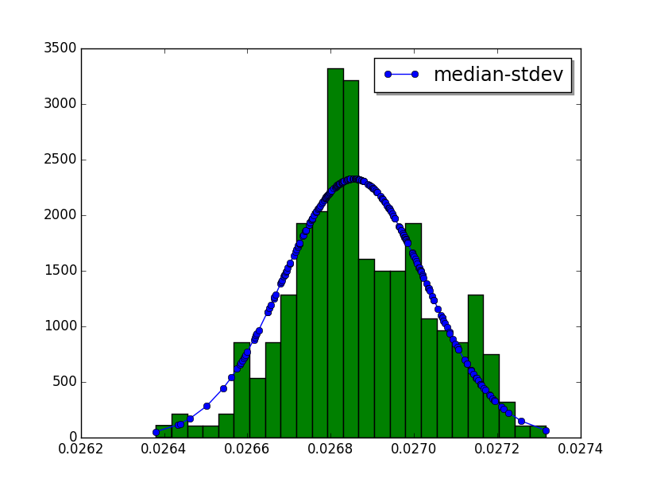

Examples
========

bench_sample_func()
-------------------

Microbenchmark using the :meth:`~perf.text_runner.TextRunner.bench_sample_func`
method to measure the performance of ``dict[key]``:

.. literalinclude:: examples/bench_sample_func.py

Pass ``--help`` to the script to see the command line options automatically
added by ``perf``.

The ``mydict[key]`` instruction is repeated 10 times to reduce the cost of the
outer ``range(loops)`` loop. To adjust the final result,
``runner.inner_loops`` is set to ``10``, the number of times that
``mydict[key]`` is repeated.

The repeatition is needed on such microbenchmark where the measured instruction
takes less than 1 microsecond. In this case, the cost the outer loop is non
negligible.

bench_func()
------------

Benchmark using the :meth:`~perf.text_runner.TextRunner.bench_func` method to
measure the time elasped when sleeping 1 ms:

.. literalinclude:: examples/bench_func.py

``time.sleep()`` is used to simulate a real workload taking at least 1 ms.

The :meth:`~perf.text_runner.TextRunner.bench_sample_func` method is
recommended if ``func()`` takes less than 1 ms. The
:meth:`~perf.text_runner.TextRunner.bench_func` method has a non negligible
overhead on microbenchmarks.

.. _hist_scipy_cmd:

hist_scipy
----------

Example to render an histogram in graphical mode using the ``scipy`` module:

.. literalinclude:: examples/hist_scipy.py

Usage::

    python3 hist_scipy.py [-n BINS/--bins=BINS] filename.json

* ``--bins`` is the number of histogram bars (default: 25)

This command requires the ``scipy`` dependency.

Example::

    $ python3 -m perf hist_scipy telco.json

Output:

API
===

Statistics
----------

.. function:: perf.is_significant(samples1, samples2)

    Determine whether two samples differ significantly.

    This uses a `Student's two-sample, two-tailed t-test
    <https://en.wikipedia.org/wiki/Student's_t-test>`_ with alpha=0.95.

    Returns ``(significant, t_score)`` where significant is a ``bool``
    indicating whether the two samples differ significantly; ``t_score`` is the
    score from the two-sample T test.

Clocks
------

.. function:: perf.perf_counter()

   Return the value (in fractional seconds) of a performance counter, i.e. a
   clock with the highest available resolution to measure a short duration.  It
   does include time elapsed during sleep and is system-wide.  The reference
   point of the returned value is undefined, so that only the difference between
   the results of consecutive calls is valid.

   On Python 3.3 and newer, it's :func:`time.perf_counter`. On older versions,
   it's :func:`time.clock` on Windows and :func:`time.time` on other
   platforms. See the PEP 418 for more information on Python clocks.

.. function:: perf.monotonic_clock()

   Return the value (in fractional seconds) of a monotonic clock, i.e. a clock
   that cannot go backwards.  The clock is not affected by system clock updates.
   The reference point of the returned value is undefined, so that only the
   difference between the results of consecutive calls is valid.

   On Python 3.3 and newer, it's :func:`time.monotonic`. On older versions,
   it's :func:`time.time` and so is not monotonic. See the PEP 418 for more
   information on Python clocks.

.. seealso::
   `PEP 418 -- Add monotonic time, performance counter, and process time
   functions <https://www.python.org/dev/peps/pep-0418/>`_.

Metadata
--------

.. class:: perf.Metadata(name, value)

   A metadata object.

   .. attribute:: name

      Metadata name.

   .. attribute:: value

      Metadata value.

Run
---

.. class:: perf.Run(samples: Sequence[float], warmups: Sequence[float]=None, metadata: dict=None, collect_metadata=True)

   A benchmark run result is made of multiple samples.

   *samples* must be a sequence of numbers (integer or float) greater
   than zero. Usually, *samples* is a list of number of seconds. Samples must
   be normalized per loop iteration (total of outer and inner loops).

   *warmups* is an optional sequence of ``(loops: int, sample: float)`` tuples
   where *sample* must be greater than or equal to zero. Warmup samples are
   "raw samples", they must not be normalized per loop iteration.

   *samples* and/or *warmups* must be a non-empty sequence. If *samples* is
   empty, the run is a calibration run.

   Samples must not be equal to zero. If a sample is zero, use more
   loop iterations: see :ref:`Runs, samples, warmups, outer and inner loops
   <loops>`.

   Set *collect_metadata* to false to not collect system metadata.

   Methods:

   .. method:: get_metadata() -> dict

      Get run metadata.

      Return a dictionary: name (``str``) => :class:`perf.Metadata` object.

      See :ref:`Metadata <metadata>`.

   .. method:: get_total_loops() -> int

      Get the total number of loops of the benchmark run:
      outer-loops x inner-loops.

   Attributes:

   .. attribute:: samples

      Benchmark run samples (``tuple`` of numbers).

   .. attribute:: warmups

      Benchmark warmup samples (``tuple`` of numbers).

Benchmark
---------

.. class:: perf.Benchmark(runs)

   A benchmark is made of multiple :class:`Run` objects.

   *runs* must be non-empty sequence of :class:`Run` objects. Runs must
   have a ``name`` metadata (all runs must have the same name).

   Methods:

   .. method:: add_run(run: Run)

      Add a benchmark run: *run* must a :class:`Run` object.

      The new run must be compatible with existing runs: metadata are compared.

   .. method:: add_runs(bench: Benchmark)

      Add runs of the benchmark *bench*.

      The benchmark must have at least one run.

      See :meth:`perf.BenchmarkSuite.add_runs` method and :func:`add_runs`
      function.

   .. method:: dump(file, compact=True, replace=False)

      Dump the benchmark as JSON into *file*.

      *file* can be a filename, or a file object open for write.

      If *file* is a filename and *replace* is false, the function fails if the
      file already exists.

      If *compact* is true, generate compact file. Otherwise, indent JSON.

   .. method:: format() -> str

      Format the result as ``... +- ...`` (median +- standard deviation) string
      (``str``).

   .. method:: format_sample(sample) -> str

      Format a sample including the unit.

      .. versionadded:: 0.7.8

   .. method:: format_samples(samples) -> str

      Format samples including the unit.

      .. versionadded:: 0.7.8

   .. method:: get_dates() -> tuple

      Get the start date of the first run and the end date of the last run.

      Return a ``(start, end)`` tuple where start and end are
      ``datetime.datetime`` objects if a least one run has a date metadata.

      Return ``(None, None)`` if no run has ``date`` metadata or if the
      benchmark has no run.

   .. method:: get_metadata() -> dict

      Get metadata common to all runs.

      Return a dictionary: name (``str``) => :class:`perf.Metadata` object.

      See :ref:`Metadata <metadata>`.

   .. method:: get_name() -> str or None

      Get the benchmark name (``str``).

      Return ``None`` if the benchmark has no run or runs have no name in
      metadata.

   .. method:: get_nrun() -> int

      Get the number of runs.

   .. method:: get_nsample() -> int

      Get the total number of samples.

   .. method:: get_nwarmup() -> int or float

      Get the number of warmup samples per run.

      Return an ``int`` if all runs use the same number of warmups, or return
      the average as a ``float``.

   .. method:: get_runs() -> List[Run]

      Get the list of :class:`perf.Run` objects.

   .. method:: get_samples()

      Get samples of all runs (values are average per loop iteration).

   .. method:: get_total_duration() -> float

      Get the total duration of the benchmark in seconds.

      Use the ``duration`` metadata of runs, or compute the sum of their
      raw samples including warmup samples.

   .. method:: get_total_loops() -> int or float

      Get the total number of loops per sample (loops x inner-loops).

      Return an ``int`` if all runs have the same number of
      loops, return the average as a ``float`` otherwise.

   .. method:: get_unit() -> str

      Get the unit of samples:

      * ``'byte'``: File size in bytes
      * ``'integer'``: Integer number
      * ``'second'``: Duration in seconds

      .. versionadded:: 0.7.9

   .. classmethod:: load(file) -> Benchmark

      Load a benchmark from a JSON file which was created by :meth:`dump`.

      *file* can be: a filename, ``'-'`` string to load from :data:`sys.stdin`,
      or a file object open to read.

   .. classmethod:: loads(string) -> Benchmark

      Load a benchmark from a JSON string.

   .. method:: median()

      Get the `median <https://en.wikipedia.org/wiki/Median>`_ of
      :meth:`get_samples`.

      The median cannot be equal to zero: :meth:`add_run` raises an error
      if a sample is equal to zero.

   .. method:: __str__() -> str

      Format the result as ``Median +- std dev: ... +- ...`` (median +-
      standard deviation) string (``str``).

   .. method:: update_metadata(metadata: dict)

      Update metadata of all runs of the benchmark.

      The benchmark must contain at least one run.

      If the ``inner_loops`` metadata is already set and its value is modified,
      an exception is raised.

      See :ref:`Metadata <metadata>`.

      .. versionadded:: 0.7.5

BenchmarkSuite
--------------

.. class:: perf.BenchmarkSuite

   A benchmark suite is made of :class:`~perf.Benchmark` objects.

   Methods:

   .. method:: add_benchmark(benchmark: Benchmark)

      Add a :class:`perf.Benchmark` object.

   .. method:: add_runs(bench: Benchmark or BenchmarkSuite)

      Add runs of benchmarks.

      *bench* can be a :class:`Benchmark` or a :class:`BenchmarkSuite`.

      Each benchmark must have at least one run. If *bench* is a benchmark
      suite, it must have at least one benchmark.

      See :meth:`perf.Benchmark.add_runs` method and :func:`add_runs` function.

   .. function:: dump(file, compact=True, replace=False)

      Dump the benchmark suite as JSON into *file*.

      *file* can be: a filename, or a file object open for write.

      If *file* is a filename and *replace* is false, the function fails if the
      file already exists.

      If *compact* is true, generate compact file. Otherwise, indent JSON.

   .. method:: get_benchmark(name: str) -> Benchmark

      Get the benchmark called *name*.

      *name* must be non-empty.

      Raise :exc:`KeyError` if there is no benchmark called *name*.

   .. method:: get_benchmark_names() -> List[str]

      Get the list of benchmark names.

      Raise an error if a benchmark has no name.

   .. method:: get_benchmarks() -> List[Benchmark]

      Get the list of benchmarks sorted by their name.

   .. method:: get_dates() -> tuple

      Get the start date of the first benchmark and end date of the last
      benchmark.

      Return a ``(start, end)`` tuple where start and end are
      ``datetime.datetime`` objects if a least one benchmark has dates.

      Return ``(None, None)`` if no benchmark has dates, or if the suite
      doesn't contain any benchmark.

   .. method:: get_metadata() -> dict

      Get metadata common to all benchmarks (common to all runs of all
      benchmarks).

      Return a dictionary: name (``str``) => :class:`perf.Metadata` object.

      See the :meth:`perf.Benchmark.get_metadata` method
      and :ref:`Metadata <metadata>`.

      .. versionadded:: 0.7.9

   .. method:: get_total_duration() -> float

      Get the total duration of all benchmarks in seconds.

      See the :meth:`perf.Benchmark.get_total_duration` method.

   .. method:: __iter__()

      Iterate on benchmarks.

   .. method:: __len__() -> int

      Get the number of benchmarks.

   .. classmethod:: load(file)

      Load a benchmark suite from a JSON file which was created by
      :meth:`dump`.

      *file* can be: a filename, ``'-'`` string to load from :data:`sys.stdin`,
      or a file object open to read.

   .. classmethod:: loads(string) -> Benchmark

      Load a benchmark suite from a JSON string.

   Attributes:

   .. attribute:: filename

      Name of the file from which the benchmark suite was loaded.
      It can be ``None``.

TextRunner
----------

.. class:: perf.text_runner.TextRunner(samples=3, warmups=1, processes=20, loops=0, min_time=0.1, max_time=1.0, metadata=None)

   Tool to run a benchmark in text mode.

   Spawn *processes* worker processes to run the benchmark.

   *metadata* is passed to the :class:`~perf.Run` constructor.

   *samples*, *warmups* and *processes* are the default number of samples,
   warmup samples and processes. These values can be changed with command line
   options. See :ref:`TextRunner CLI <textrunner_cli>` for command line
   options.

   If isolated CPUs are detected, the CPU affinity is automatically
   set to these isolated CPUs. See :ref:`CPU pinning and CPU isolation
   <pin-cpu>`.

   Methods:

   .. method:: bench_func(name, func, \*args, inner_loops=None)

      Benchmark the function ``func(*args)``.

      *name* is the name of the benchmark.

      The *inner_loops* parameter is used to normalize timing per loop
      iteration.

      The design of :meth:`bench_func` has a non negligible overhead on
      microbenchmarks: each loop iteration calls ``func(*args)`` but Python
      function calls are expensive. The :meth:`bench_sample_func` method is
      recommended if ``func(*args)`` takes less than ``1`` millisecond
      (``0.001`` second).

      To call ``func()`` with keyword arguments, use ``functools.partial``.

      Return a :class:`~perf.Benchmark` instance.

   .. method:: bench_sample_func(name, sample_func, \*args, inner_loops=None)

      Benchmark ``sample_func(loops, *args)``.

      *name* is the name of the benchmark.

      The function must return raw samples: the total elapsed time of all
      loops. TextRunner will divide raw samples by ``loops x inner_loops``
      (*loops* and *inner_loops* parameters).

      :func:`perf.perf_counter` should be used to measure the elapsed time.

      To call ``sample_func()`` with keyword arguments, use
      ``functools.partial``.

      Return a :class:`~perf.Benchmark` instance.

   .. method:: parse_args(args=None)

      Parse command line arguments using :attr:`argparser` and put the result
      into the :attr:`args` attribute.

      Return the :attr:`args` attribute.

   Attributes:

   .. attribute:: args

      Namespace of arguments: result of the :meth:`parse_args` method, ``None``
      before :meth:`parse_args` is called.

   .. attribute:: argparser

      An :class:`argparse.ArgumentParser` object used to parse command line
      options.

   .. attribute:: metadata

      Benchmark metadata (``dict``).

   .. attribute:: name

      Name of the benchmark.

   .. attribute:: inner_loops

      Number of benchmark inner-loops (``int`` or ``None``).

   .. attribute:: prepare_subprocess_args

      Callback used to prepare command line arguments to spawn a worker
      process. The callback is called with ``prepare(runner, cmd)`` where *cmd*
      is a list of strings (command line arguments). *cmd* must be modified
      in-place.

      For example, the callback can be used to add arguments not handled
      directly by :class:`~perf.text_runner.TextRunner`.

   .. attribute:: program_args

      Command list arguments to call the program:
      ``(sys.executable, sys.argv[0])`` by default.

Functions
---------

.. function:: perf.add_runs(filename: str, result)

   Append a :class:`Benchmark` or :class:`BenchmarkSuite` to an existing
   benchmark suite file, or create a new file.

   If the file already exists, adds runs to existing benchmarks.

   See :meth:`perf.BenchmarkSuite.add_runs` method.

.. function:: perf.python_implementation()

   Name of the Python implementation in lower case.

   Examples:

   * ``cpython``
   * ``ironpython``
   * ``jython``
   * ``pypy``

   Use ``sys.implementation.name`` and ``platform.python_implementation()``.

   See also the `PEP 421 <https://www.python.org/dev/peps/pep-0421/>`_.

   .. versionadded:: 0.7.4

.. function:: perf.python_has_jit()

   Return ``True`` if Python has a Just In Time compiler (JIT).

   For example, return ``True`` for PyPy but ``False`` for CPython.

   .. versionadded:: 0.7.4
